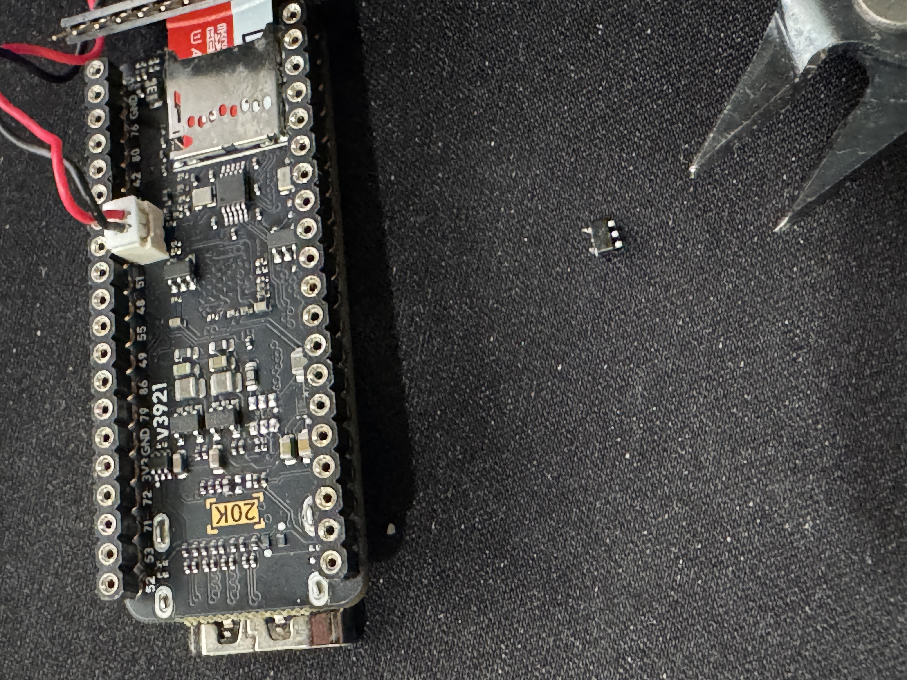
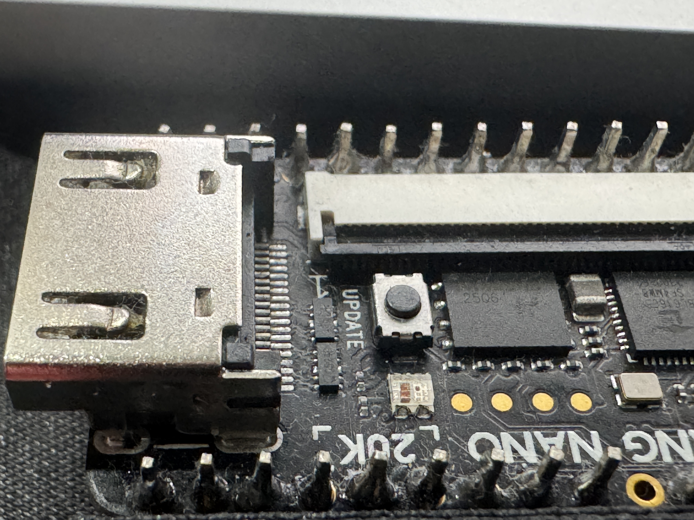
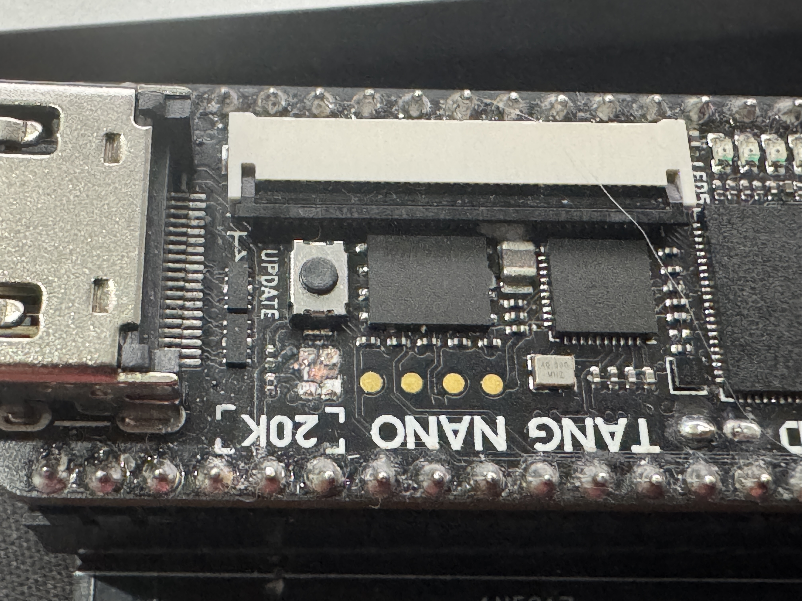

# NEW JUICE Firmware for WonderTANG 2.02b

This is a brand new built from scratch firmware for the WonderTANG 2.0b boards only. Older boards requires the older firmware: https://github.com/lfantoniosi/WonderTANG

# What's new

This is a much stable FPGA code with new and improved features:
- OPM FM chip (SFG-01 module). It can be used in Yamaha Voice Program or VGMPlayer
- Improved MegaRAM SCC with support for larger K5 models and default mode to K4/K5/DDX
- new SMRAM.COM program
- FM bioses are loaded from SPI flash

# TLDR;

If you need to flash your band new WonderTang 2.0b do these steps:

- Clone this repository
- Install openFPGAloader (via brew, apt-get, pacman or any other package manager) 
- execute on terminal: 
```
cd new-juice
make roms
make reprogram
```

# New Juice Project

FPGA design for the WonderTANG MSX interface, targeting the Gowin
GW2AR-LV18QN88C8/I7 device. The current design implements the MSX bus
interface, a slot expander, and an SDRAM-backed memory mapper.

At startup, the design also copies two ROM images from the onboard SPI flash
into SDRAM above the 2 MiB Super-MegaRAM region. The MSX `/WAIT` line remains
asserted until SDRAM initialization, its startup test, and the ROM copy have
completed.

## Hardware

- Gowin GW2AR-18C FPGA (`GW2AR-LV18QN88C8/I7`)
- 27 MHz board clock
- 3.58 MHz MSX CPU clock
- 32-bit SDRAM interface

## Project layout

- `new-juice.gprj` — Gowin EDA project
- `src/` — Verilog/SystemVerilog sources, pin constraints, and timing constraints
- `roms/` — ROM images used by the design
- `impl/` — Gowin implementation configuration

## Flash ROM layout

| ROM | SPI flash | SDRAM cache | Expanded subslot | MSX address |
| --- | --- | --- | --- | --- |
| MSX-DOS2 ASCII MegaROM | `0x100000–0x11FFFF` | `0x600000–0x61FFFF` | 0 | `0x4000–0x7FFF` |
| FM-PAC | `0x120000–0x123FFF` | `0x620000–0x623FFF` | 1 | `0x4000–0x7FFF` |

The DOS2 ROM is divided into eight 16 KiB banks. Writing the bank number to
`0x6000` selects the bank visible at `0x4000–0x7FFF`; only bits 2:0 are used.
The FM-PAC image is a fixed 16 KiB ROM.

## Super-MegaRAM

Expanded subslot 2 contains a 2 MiB Super-MegaRAM at SDRAM
`0x400000–0x5FFFFF`. Its MSX aperture is `0x4000–0xBFFF`. It powers up in
MegaRAM DDX with SCC mode and supports DDX with or without SCC, ASCII8,
ASCII16, Konami K4, and Konami K5 with SCC.
The K4 implementation includes the MegaRAM-compatible selectable
`0x4000–0x5FFF` segment.
DDX modes accept bank-register writes at both `0x4000/0x5000`,
`0x6000/0x7000`, `0x8000/0x9000`, and `0xA000/0xB000` for banks 0–3.

Reading I/O port `0x8E` selects writable RAM mode and writing it selects
write-protected paging/ROM mode. Port `0x8F` selects mapper type `0`, `1`, `4`,
`5`, `8`, or `16`. Neither MegaRAM control port drives the data bus during a
read.

## SD-card interface

The onboard microSD card is exposed through the DOS2 ROM in expanded subslot
0. Writing `1` to `0x7E00` overlays the SD transfer RAM and registers onto the
ROM; writing `0` restores normal ROM reads.

| Address | Access | Description |
| --- | --- | --- |
| `0x7C00–0x7DFF` | Read/write | 512-byte sector transfer RAM |
| `0x7E00` | Write | Enable or disable the SD overlay |
| `0x7E01` | Write | Command: `0x80` initialize, `1` read, `2` write |
| `0x7E02` | Read | Status: bit 7 busy, bit 1 timeout, bit 0 CRC error |
| `0x7E03–0x7E06` | Write | 32-bit sector address, least-significant byte first |
| `0x7E07–0x7E09` | Read | CSD device size |
| `0x7E0A` | Read | CSD size multiplier |
| `0x7E0B` | Read | CSD read block length |
| `0x7E0C` | Read | Card type: unknown, SDv1, SDv2, or SDHCv2 |
| `0x7E0D` | Read | Manufacturer ID |
| `0x7E0E–0x7E0F` | Read | OEM ID |
| `0x7E10–0x7E14` | Read | Product name |
| `0x7E15–0x7E18` | Read | Product serial number |

The status values are `0x00` for success/idle, `0x80` while busy, `0x01` for
a CRC error, and `0x02` for a timeout. Error bits can be combined with busy.

## Building

Run the complete Gowin synthesis, place-and-route, and bitstream flow from the
repository root:

```sh
make
```

The resulting bitstream is written to `impl/prn/new-juice.fs`. Use
`make rebuild` to force a complete rebuild.

On macOS the Makefile defaults to the Gowin installation at
`/Applications/GowinIDE.app/Contents/Resources/Gowin_EDA/IDE`. Override the
installation or executable path when needed:

```sh
make GOWIN_IDE=/path/to/Gowin/IDE
make GW_SH=/path/to/gw_sh
```

The project can still be built through the GUI by opening `new-juice.gprj` and
running synthesis and place-and-route.

The project expects Gowin EDA support for the GW2AR-18C family.

## Installing the toolchain (macOS and Linux)

Install the Gowin EDA Education edition for the GW2AR-18 device from Gowin or
Sipeed, and activate the license using Gowin's license manager if requested by
the installer. The command-line executable used by this project is `gw_sh`.

On macOS, the default installation is:

```sh
/Applications/GowinIDE.app/Contents/Resources/Gowin_EDA/IDE/bin/gw_sh
```

On Linux, install the vendor archive in `/opt/Gowin/IDE` (or another
user-writable directory) and make sure its `bin/gw_sh` is executable. The
location can be overridden with `GOWIN_IDE` or `GW_SH`:

```sh
make GOWIN_IDE=/opt/Gowin/IDE
make GW_SH=/opt/Gowin/IDE/bin/gw_sh
```

Install `openFPGALoader` from your distribution or its upstream project. On
Linux, also install the loader's udev rules (or add an equivalent rule for the
Tang Nano 20K USB/JTAG device), then reconnect the board so it is accessible to
your user without `sudo`.

## Windows Users

Well, at this point in time and you still using this bloatware-AI-minion-copiloted piece of something? Time to look at the mirror and reflect about your life. I don't have a working Windows machine and I cannot help you. (And I remember it sucked hard with all usb conflicts and ports stopping accessing the unit)

## Build and program

From the repository root, connect a powered Tang Nano 20K by USB and run:

```sh
# Initialize the JT49, JT51, and JTOPL submodules after cloning
make init

# Synthesis, place-and-route, and bitstream generation
make

# Remove the previous implementation outputs and build from scratch
make rebuild

# Program the generated bitstream (impl/prn/new-juice.fs)
make program

# Flash the existing bitstream only (does not rebuild)
make reprogram

# Program the ROM images into SPI flash
make roms
```

All JT submodules are locked to the exact gitlink commits recorded by this
repository. Incremental and clean builds verify that each core is initialized,
is checked out at that exact commit, and has no local modifications. If a core
does not match, the build stops rather than silently synthesizing different
HDL. Run `make init` to restore a mismatched revision; local submodule changes
must be committed and pinned deliberately or removed before building.

The Makefile defaults to the macOS Gowin path above when running on macOS and
`/opt/Gowin/IDE` on Linux. It also accepts `OPENFPGALOADER` and
`PROGRAMMER_BOARD` overrides, for example:

```sh
make GOWIN_IDE="$HOME/Gowin/IDE" \
     OPENFPGALOADER="$HOME/bin/openFPGALoader" \
     PROGRAMMER_BOARD=tangnano20k program
```

Use `make reprogram` when the Tang Nano 20K should only be flashed with the
already-built `impl/prn/new-juice.fs`. Unlike `make program`, it does not add
the bitstream as a build dependency or invoke synthesis; run `make` or
`make rebuild` first when the bitstream needs to be regenerated.

`make roms` writes DOS2 at SPI-flash offset `0x100000`, then writes one
combined image containing FM-PAC at `0x120000` and SFG-01 at `0x124000`.
FM-PAC and SFG-01 are programmed together because the adjacent images share
one flash erase sector. Do not interrupt power while either programming
operation is in progress.
The same project can be opened in the Gowin GUI by opening `new-juice.gprj`.

## Tang Nano 20K hardware modifications

The following modifications are optional and permanently alter the board.
Disconnect USB and all external power, use ESD protection, and inspect the
board under magnification before powering it again. Removing components can
void the warranty and can damage pads or nearby traces; proceed only if you
accept that risk.

### Removing the LCD-backlight driver

The small backlight-driver IC is shown in the photograph below. With the board
unpowered, hold the IC body with fine pliers and snip/lift one lead at a time.
Do not twist against the PCB, do not bridge adjacent pads, and remove every
loose fragment before testing for shorts with a meter.

<p></p>

### Removing the onboard RGB LED

The LED can be removed with hot-air/desoldering tools. If those are not
available, protect the PCB and carefully crush the LED package, then cut and
scrape the remaining leads away with pliers. Work slowly so the pads and the
nearby components are not pulled from the board. Verify that no LED lead or
metal fragment remains shorting a supply or signal before reassembly.

<p></p>
<p></p>

## MSX bus pins

| MSX bus | FPGA signal | Direction | Notes |
| --- | --- | --- | --- |
| D7–D0 | `cd[7:0]` | Bidirectional | `datadir` controls direction: 0 = output, 1 = input |
| `/INT` | `int_out` | Output | Open-collector interrupt |
| `/BUSDIR` | `busdir_n` | Output | 0 = output, 1 = input |
| `/WAIT` | `wait_out` | Output | Open-collector CPU wait |
| `/RD` | `rd_n_in` | Input | Read strobe |
| `/WR` | `wr_n_in` | Input | Write strobe |
| `/SLTSL` | `sltsl_n_in` | Input | Slot select |
| CLOCK | `cpu_clkin` | Input | MSX CPU clock |

## Tang Nano 20K FPGA pinout and shared pins

The table below is the complete pin assignment used by `src/top.cst`. Numbers
are Gowin package pin numbers, not header pin numbers. Signals marked as
shared are connected to the corresponding Tang Nano 20K peripheral or to the
MSX expansion connector in this design.

Pins not listed are intentionally left unassigned by this FPGA design; consult
the official schematic linked below for their board/header routing.

| Function | FPGA signal | Package pin | Board connection / sharing |
| --- | --- | ---: | --- |
| MSX data D7..D0 | `cd[7:0]` | 49, 53, 71, 72, 79, 86, 41, 48 | Bidirectional MSX data bus |
| MSX multiplexed MP7..MP0 | `mp[7:0]` | 31, 30, 29, 26, 25, 28, 27, 77 | Address/control bus selected by `msel_n` |
| MP select | `msel_n[2:0]` | 19, 20, 17 | MSX bus demultiplexer select |
| Data direction | `datadir` | 52 | MSX transceiver direction |
| Interrupt | `int_out` | 73 | MSX `/INT`, open-collector behavior |
| Slot select | `sltsl_n_in` | 18 | MSX `/SLTSL` input |
| Write/read strobes | `wr_n_in`, `rd_n_in` | 16, 15 | MSX `/WR`, `/RD` inputs |
| CPU clock | `cpu_clkin` | 76 | External MSX CPU clock |
| Wait/bus direction | `wait_out`, `busdir_n` | 42, 74 | MSX `/WAIT` and `/BUSDIR` |
| Board clock | `clkin` | 4 | 27 MHz oscillator |
| User buttons | `s1`, `s2` | 88, 87 | Active-low reset/control inputs |
| Status LED | `led` | 75 | Board status LED |
| I2S audio | `hp_din`, `hp_bck`, `hp_ws`, `pa_en` | 54, 56, 55, 51 | MAX98357A data, bit clock, word select, enable |
| microSD | `sd_dat3`, `sd_dat2`, `sd_dat1`, `sd_sclk`, `sd_dat0`, `sd_cmd` | 81, 80, 85, 83, 84, 82 | SDIO data, clock, and command |
| SPI flash | `mspi_sclk`, `mspi_cs`, `mspi_mosi`, `mspi_miso` | 59, 60, 61, 62 | Onboard configuration flash |
| HDMI TMDS data | `tmds_data_p[0]`, `[1]`, `[2]` | 35/36, 37/38, 39/40 | Differential TMDS pairs |
| HDMI TMDS clock | `tmds_clk_p` | 33/34 | Differential TMDS clock pair |

The `mp` pins are time-multiplexed. Their meanings are:

| `msel_n` | MP0 | MP1 | MP2 | MP3 | MP4 | MP5 | MP6 | MP7 |
| --- | --- | --- | --- | --- | --- | --- | --- | --- |
| `110` | A0 | A1 | A2 | A3 | A4 | A5 | A6 | A7 |
| `101` | A8 | A9 | A10 | A11 | A12 | A13 | A14 | A15 |
| `011` | `/MERQ` | `/IORQ` | `/CS1` | `/CS2` | `/RESET` | `/RFSH` | `/CS12` | `/M1` |

Consequently, `mp[4]` is not a permanently dedicated reset input: it carries
A4, A12, or `/RESET` according to `msel_n`. External circuitry must sample the
bus only during the selected phase and must not drive two phases at once.

For board-level connector drawings and the unmodified Tang Nano 20K schematic,
see the [Sipeed Tang Nano 20K hardware documentation](https://wiki.sipeed.com/hardware/en/tang/tang-nano-20k/nano-20k.html)
and the [official schematic PDF](https://dl.sipeed.com/fileList/TANG/Nano_20K/2_Schematic/Tang_Nano_20K_3850_Schematics.pdf).
